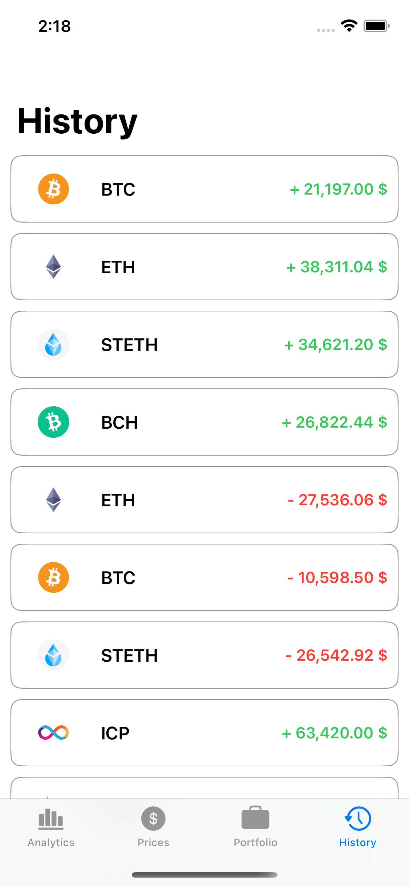

# Crypto Portfolio (iOS)
Crypto portfolio iOS mobile app built for my EBC-VI1 - Application Development for iOS course.

## What I Learned
- Processed values from REST API and Core Data using **Combine** framework 
- Implemented custom chart using **SwiftUIChart** external library
- Designed in **MVVM** architecture

## Main Features
<p align="center"></p>

## Screenshots
<p align="center">
  <br>
  
</p>

## Repo Structure
```
/
├─ assets.xcassets/
├─ extensions/                      # helper
│   ├─ Double.swift
│   └─ PreviewProvider.swift
│
├─ model/                           # model for crypto
│   └─ Coin.swift
│
├─ preview content/
│
├─ service/
│   ├─ ActivityHistoryService.swift # data from Activity History model
│   ├─ CoinImageService.swift       # API for images
│   ├─ DataService.swift            # API crypto
│   ├─ Persistence.swift            # core data
│   └─ PortfolioService.swift       # data from Portfolio model
│
├─ view/                            # UI 
│   ├─ ContentView.swift
│   ├─ FormAssetView.swift
│   ├─ analytics/
│   ├─ historylist/
│   ├─ portfoliolist/
│   ├─ pricelist/
│   └─ rowrcrypto/
│
├─ viewmodel/                       # designed to store and manage UI-related data
│
├─ .gitignore                       # untracked files 
├─ CryptoPortfolioApp.swift         # main 
├─ Info.plist                       # info about project
└─ README.md                        # this file
```
